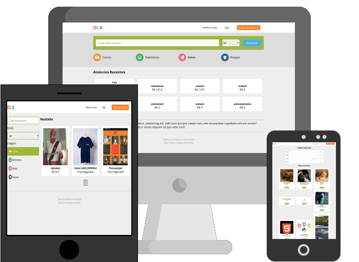

<h1 align="center">E-commerce inspirado na OLX</h1>

    

<h2>:rocket: Tecnologias Usadas</h2>

  
  
  
  

<h2>:floppy_disk: Instalação</h2>

<code>npm install</code>

<h2>:dvd: Iniciar</h2>

<code>npm run dev</code>

<h2>:computer: Projeto</h2>

Projeto desenvolvido para fins didáticos durante o curso do [Bonyeck Lacerda](https://www.instagram.com/bonieky) na plataforma B7Web.  

É um projeto com muitas funcionalidades entre elas pesquisar anúncios por filtros, login, postar anúncios, área do usuário para editar dados da conta e anúncios postados.  
Utiliza React Router Dom, hooks e reducers do Redux e login por meio de cookies.  
Consome dados de uma API compartilhada entre os alunos da B7Web.   
Este é um projeto antigo da plataforma e possui alguns bugs. A API usa protocolo HTTP então não é possível realizar as requisições necessárias quando implantado no GitHub Pages, erro "Mixed content". Caso saiba como resolver sem acesso as configurações da API ou onde estudar a solução, por favor entre em contato.
Há a pretenção de desenvolver uma nova versão após concluir os estudos em NodeJS para a criação de API própria.  
Para ver o projeto completo, rode localmente.

<h2>:eyes: Implantação</h2>

Veja o projeto em [GitHub Pages](https://caiquedv.github.io/react_inspired-olx/).

